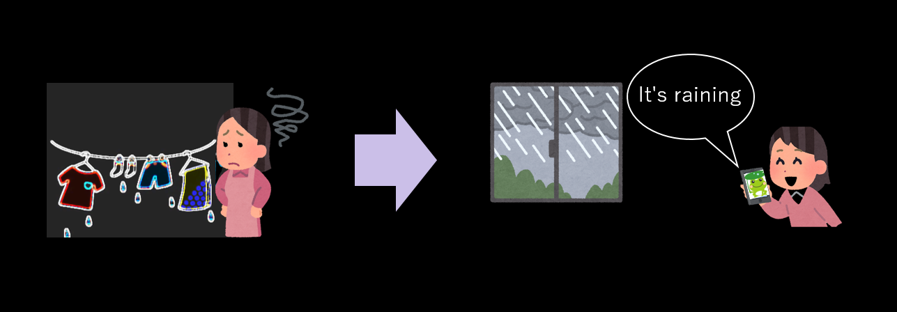
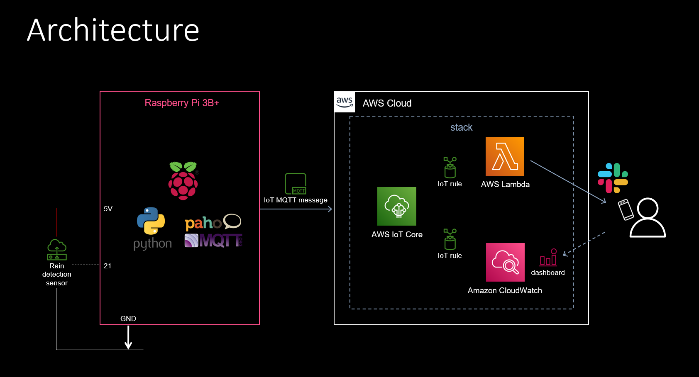
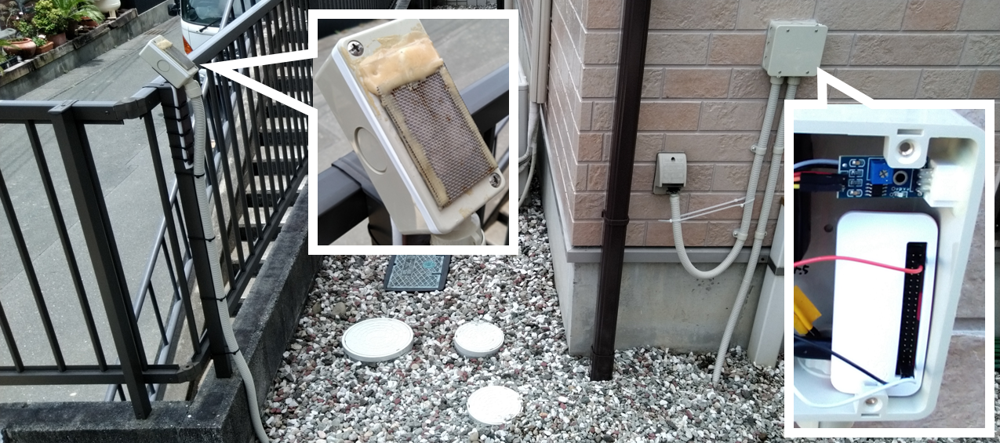

# Rain-notification-on-Raspberry-Pi-aws-and-slack
When the self-made sensor detects the beginning of rain, publish it from Raspberry Pi to AWS IoT and notify slack from AWS Lambda.
<br>

## **What can be done**
Even if you are in the house, you can know when it starts to rain with a pop-up notification on your smartphone between 6 and 18 o'clock.  Notification time can be changed arbitrarily.  

<br />

<br />
<br />

## **Architecture**
<br />

<br />
<br />

## **Schematic photo**
<br />

<br />
<br />

## **Physical specifications**
### **Sensor**

For rain detection：  
* Original self-made  
* Divert control board   https://www.amazon.co.jp/gp/product/B01N1GOC7S/ref=ppx_yo_dt_b_search_asin_title?ie=UTF8&psc=1&language=ja_JP  
<br>

#### **RaspberryPi**
Hardware: BCM2835  
Model: Raspberry Pi Zero W Rev 1.1  
microSD card: 32GB or more  
<br>
<br />

## **Development environment**
#### **RaspberryPi**
Kernel: Linux  
Kernel release No.: 4.19.97+  
Kernel version: #1294 Thu Jan 30 13:10:54 GMT 2020 armv6l  
OS： Raspbian GNU/Linux 10 (buster)  
Language: python 3.7.3  
#### **Windows**
Editor: VSCode  
VSCode expantions: Python、Pylance、MagicPython、GitLens、Git Histry、Git Graph、Markdown All in One、Excel to Markdown table  
SCP client: WinSCP ver. 5.19  
SSH terminal client: TeraTerm ver. 4.105  
<br>
<br>

## **Construction procedure**
<br>

### **Preparation**
1.  Prepare RaspberryPi OS image disc.  https://www.raspberrypi.com/software/
2.  Prepare an aws account.
3.  Prepare IAM user with 6 custom managed policies of ./user_policy and AWSIoTFullAccess attached, or IAM user with administrator authority attached so that both console login and access key can be used.  You must replace "accountID" to your accountID in 6 policies.
4. Download access key ID and secret access key.
5. Connect the tain detection sensor to GPIO port21 as shown in the Architecture.
6. Insert the OS image disc into the Raspberry Pi and turn on the power.
7. Make initial settings for Raspberry Pi and connect to the Internet.
<br>
<br>

### **Building an environment on Raspberry Pi**
Launch Raspberry Pi that can connect to the Internet.  
  
  
Clone this project from public repository
```sh  
git clone https://github.com/nsaito9628/Rain-notification-on-Raspberry-Pi-aws-and-slack.git
```
  
Deploy a project  
``` sh
sudo cp ./Rain-notification-on-Raspberry-Pi-aws-and-slack/src/* ./*
```

Download and unpack the required packages
```sh
cd ..
sudo chmod u+x environment.sh
./environment.sh
```
  
Set aws configuration as default profile  
```sh
aws configure 
```
>(Replace with your own key)    
    AWS Access Key ID[]: your Access Key ID  
    AWS Secret Access Key []: your Secret Access Key  
    Default region name []: ap-northeast-1  
    Default output format []:  

Customize parameters (if needed)  
``` sh
cd cert
sudo nano iot_prov_config
```
Parameters customizable as below 
>THING NAME (same as Project Name)
DEVICE
TOPIC_DASHBOARD (same as Topic1 in template.yaml)  
TOPIC_LAMBDA (same as Topic2 in template.yaml)  
SENSOR_NO

Registration of RaspberryPi as a thing to AWS IoT core and automatic startup setting
```sh
sudo chmod u+x iot_prov.sh
./iot_prov.sh
```
  
```sh
cd ../Rain-notification-on-Raspberry-Pi-aws-and-slack/template
```
Rewrite to your own parameters(if needed)
```
sudo nano tmplate.yaml   
```
 
Parameters customizable as below  
>NameTag  
ProjectName (same as THING_NAME in iot_prov_config)  
Topic1 (same as TOPIC_DASHBOARD in iot_prov_config)  
Topic2 (same as TOPIC_LAMBDA in iot_prov_config)  

<br>

Deploy CloudFormation stack
```sh
sam build
sam deploy --guided --capabilities CAPABILITY_NAMED_IAM
```
>#Enter any stack name and [Y/N]  
        Stack Name [sam-app]: any-stack-name    
        AWS Region [ap-northeast-1]:  
        Parameter ProjectName [RainDetection]:  
        Parameter Region [ap-northeast-1]:  
        Parameter AccountID [Your AccountID]:  
        Parameter Topic1 [dashboard]:  
        Parameter Topic2 [lambda]:  
        Parameter Metric1 [rain_detection]:   
        Parameter PostURL [Your Slack Webhook URL]:  
        Parameter NameTag [RainDetectionNotifier]:  
        #Shows you resources changes to be deployed and require a 'Y' to initiate deploy
        Confirm changes before deploy [Y/n]: Y  
        #SAM needs permission to be able to create roles to connect to the resources in your template  
        Allow SAM CLI IAM role creation [Y/n]: Y  
        #Preserves the state of previously provisioned resources when an operation fails
        Disable rollback [Y/n]: Y  
        Save arguments to configuration file [Y/n]: Y  
        SAM configuration file [samconfig.toml]:  
        SAM configuration environment [default]:  
        ・  
        ・  
        ・  
        Deploy this changeset? [y/N]: y  
Confirm message like "Successfully created/updated stack - any-stack-name in ap-northeast-1"  
  
Restart Raspberry Pi
```sh
sudo reboot   
```  
  
## **Utilization in living space** ##

From the IAM user's management console, go to CloudWatch> Dashboards> Rain Detection Dashboard (Your Dashboard) and see the signal from the Raspberry Pi.  Check pop-up notifications from slack on your smartphone. 